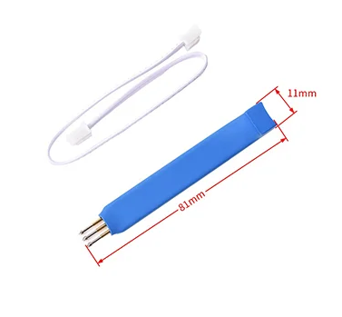
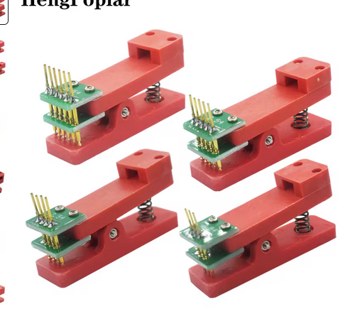

# Go powered Name Tag

This project is based in [Ayke's famous LED earrings](https://github.com/aykevl/things/tree/master/earring-ring). This is the TinyGo nametag. It sports 18 individually addressable RGB LEDs, a buttong, a minuscule ATTINY1616 as its brains, a brooch on the back to hang it on your clothes and a big white area on the front to write your name (or whatever you want) with permanent markers (easily removable with the help of a bit of alcohol), perfect to display your creativity. The nametag is powered by the ubiquitous CR2032 coin cell that you can find everywhere and its battery life surpass 30h+.  The nametag comes with several pre-defined effects, but you could write your own using Go


*<<Hello, my name is Iñi-**go** Montoya. You compiled my code. Prepare to debug.>>*

*Iñi-**go** Montoya, The Princess Bride*


*You can remove the marker writting with the help of some alcohol*


The logic and the animations are all written in Go. The LEDs are controlled using bitbanging which is done in handcrafted inline assembly in C (through CGo).

In this directory you'll find:

  * The source files.

## Programming

The PCB exposes a few pins:

  - `VCC`, the plus side of the battery
  - `R`, the programming pin (originally "reset" but actually just the UPDI programming pin)
  - `GND`, the battery minus side

**Be careful** with connecting the `+`! Probably, don't do it at all unless you put in some resistor. The LEDs are connected without any resistors and expect some internal resistance from the button cell battery.

You can use a UPDI programmer like [Adafruit's UPDI friend](https://www.adafruit.com/product/5879) or make a programmer quite easily using a USB to UART (like the FT232H or CH340G) converter and a 1kΩ resistor. You can find details on the [pymcuprog](https://pypi.org/project/pymcuprog/) project page (see "Serial port UPDI (pyupdi)").

Additionally, you should use a "pogo s clip" or "pogo pins programmer" (use those query on your favourite hardware website to find them) like the following so it's easier to programm the tags:





To program, insert a CR2032 coin cell battery and connect the `-` to the UART ground and `R` to the UPDI programming pin. Then run the following command:

    tinygo flash -target=attiny1616

That's all! It'll take a few seconds and the new code is running on the chip.


## Simulating

You can also simulate the code for easier debugging. Just run it as a Go program:

```
go run .
```


## Credits

This project is based in [Ayke's famous LED earrings](https://github.com/aykevl/things/tree/master/earring-ring).


## License

Public domain. Feel free to use however you wish. Attribution is appreciated though.
