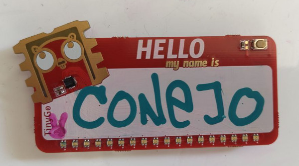
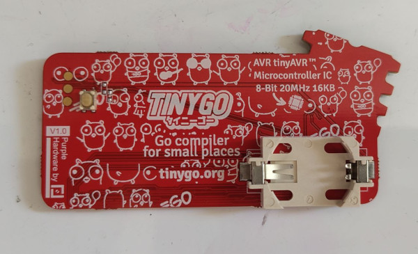
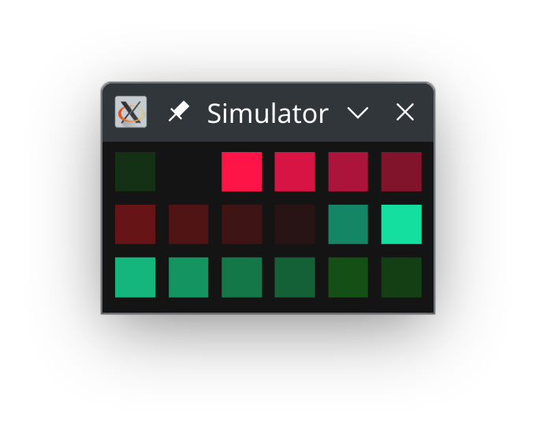

# Go powered Name Tag

This project is based in [Ayke's famous LED earrings](https://github.com/aykevl/things/tree/master/earring-ring). The nametag has 18 individually addressable RGB LEDs and a big white area to write your name with a permanent marker.




The logic and the animations are all written in Go. The LEDs are controlled using bitbanging which is done in handcrafted inline assembly in C (through CGo).

In this directory you'll find:

  * The source files.

## Programming

The PCB exposes a few pins:

  - `+`, the plus side of the battery
  - `R`, the programming pin (originally "reset" but actually just the UPDI programming pin)
  - `-`, the battery minus side

**Be careful** with connecting the `+`! Probably, don't do it at all unless you put in some resistor. The LEDs are connected without any resistors and expect some internal resistance from the button cell battery.

You can make a programmer quite easily using a USB to UART converter and a 1kΩ resistor. You can find details on the [pymcuprog](https://pypi.org/project/pymcuprog/) project page (see "Serial port UPDI (pyupdi)").

To program, insert a CR2032 coin cell battery and connect the `-` to the UART ground and `R` to the UPDI programming pin. Then run the following command:

    tinygo flash -target=attiny1616

That's all! It'll take a few seconds and the new code is running on the chip.


## Simulating

You can also simulate the code for easier debugging. Just run it as a Go program:

```
go run .
```




## Credits

This project is based in [Ayke's famous LED earrings](https://github.com/aykevl/things/tree/master/earring-ring).


## License

Public domain. Feel free to use however you wish. Attribution is appreciated though.
